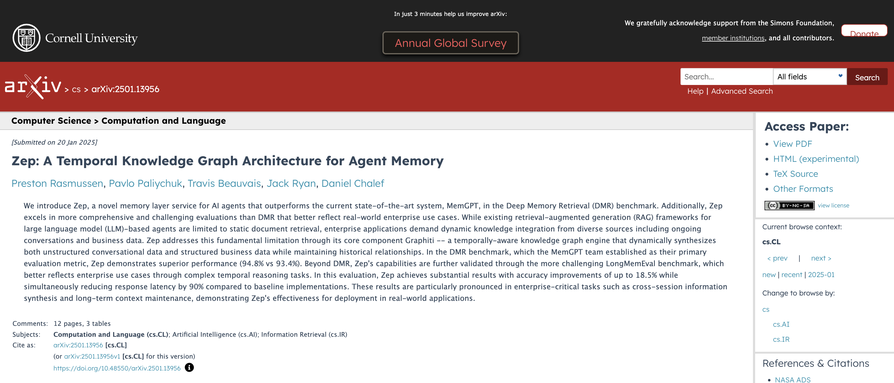

# 🚀 Форк Graphiti с поддержкой FalkorDB

> **ВАЖНО**: Это форк [Graphiti](https://github.com/getzep/graphiti), который заменяет Neo4j на FalkorDB и добавляет критически важные функции для production использования.

## 🎯 Что добавлено в этом форке

> **Примечание**: Этот форк исправляет критические ошибки официального `graphiti-core[falkordb]` v0.18.7, который не работает с FalkorDB из-за отсутствующих функций

### 1. **FalkorDB как основная база данных** (замена Neo4j)
- **Проблема с Neo4j**: Community Edition не поддерживает векторный поиск (`vector.similarity.cosine` требует Enterprise лицензию)
- **Решение**: FalkorDB имеет нативную поддержку векторов через тип `vecf32` - без ограничений лицензии
- **Преимущества**: 
  - Меньший размер Docker образа
  - Быстрее запускается
  - Нативные векторные операции из коробки
  - Полностью open source

### 2. **Полнотекстовый поиск по связям (relationships)**
- **Проблема**: FalkorDB не поддерживает `db.idx.fulltext.queryRelationships` ([планируется в Issue #1211](https://github.com/FalkorDB/FalkorDB/issues/1211))
- **Протестировано**: 
  - Официальный `graphiti-core[falkordb]` v0.18.7 при попытке поиска выдает: `Procedure 'db.idx.fulltext.queryRelationships' is not registered`
  - Проверка через `CALL dbms.procedures()` подтверждает отсутствие этой процедуры
  - Доступны только: `queryNodes`, `createNodeIndex`, `drop`
- **Решение**: Реализован паттерн FactIndex для полнотекстового поиска по фактам
- **Как работает**:
  ```cypher
  # Вместо (недоступно в FalkorDB):
  CALL db.idx.fulltext.queryRelationships('RELATES_TO', 'поисковый запрос')
  
  # Используем:
  CALL db.idx.fulltext.queryNodes('FactIndex', 'поисковый запрос')
  YIELD node, score
  MATCH (n)-[e:RELATES_TO {uuid: node.fact_id}]->(m)
  ```
- **Поддерживает все операторы RediSearch**: wildcards (*), фразы (""), OR (|), NOT (-)

### 3. **Relevance Score в результатах**
- **Проблема**: Оригинальный Graphiti вычисляет score, но не возвращает его
- **Решение**: Модифицированы методы поиска для включения score в результаты
- **Использование**: `edge.score` теперь доступен в результатах поиска для фильтрации

## 📦 Быстрый старт с FalkorDB

```python
from graphiti_core import Graphiti
from graphiti_core.driver.falkordb_driver import FalkorDriver

# Подключение к FalkorDB (вместо Neo4j)
driver = FalkorDriver(
    host="localhost",
    port=6379,
    password=""  # или ваш пароль
)

# Всё остальное работает так же!
graphiti = Graphiti(graph_driver=driver)

# Добавление данных
await graphiti.add_episode(
    name="Факты о компании",
    episode_body="Tesla была основана Илоном Маском в 2003 году.",
    source_description="Бизнес данные"
)

# Поиск с оценкой релевантности
results = await graphiti.search("Tesla основана*")
for edge in results:
    print(f"Факт: {edge.fact}")
    print(f"Релевантность: {edge.score}")  # Теперь доступно!
```

## 🔧 Технические детали

### Реализация FactIndex
Расположена в: `graphiti_core/search/search_utils.py::edge_fulltext_search()`

При создании связей автоматически генерируются соответствующие узлы FactIndex:
```python
FactIndexNode(
    fact_id=edge.uuid,      # Связь с оригинальной связью
    text=edge.fact,         # Полный текст для поиска
    text_lower=fact.lower(), # Регистронезависимый поиск
    keywords=keywords,       # Извлечённые ключевые слова
    group_id=edge.group_id  # Для фильтрации
)
```

### Изменённые файлы
- `graphiti_core/utils/bulk_utils.py` - Создаёт узлы FactIndex
- `graphiti_core/search/search_utils.py` - Реализует поиск через FactIndex
- `graphiti_core/graph_queries.py` - Запросы специфичные для FalkorDB
- `graphiti_core/nodes.py` - Добавлен класс FactIndexNode

### 4. **N8n интеграция для обработки промптов**
- **Проблема**: Промпты в Graphiti работают нестабильно, сложно подключить разные LLM модели через OpenRouter и другие провайдеры
- **Решение**: Все вызовы LLM вынесены в n8n workflows через webhook интеграцию
- **Как работает**:
  ```bash
  # Включить n8n обработку
  export USE_N8N_PROCESSING=true
  export N8N_WEBHOOK_URL="https://your-n8n.com/webhook/graphiti"
  ```
- **Поддерживаемые операции через n8n**:
  - `extract_nodes` - экстракция узлов из эпизода
  - `dedupe_nodes` - дедупликация узлов
  - `extract_edges` - экстракция связей
  - `dedupe_edges` - дедупликация связей
  - `invalidate_edges` - инвалидация противоречащих фактов
  - `extract_nodes_reflexion` - рефлексия для пропущенных узлов
  - `extract_edges_reflexion` - рефлексия для пропущенных связей
- **Преимущества**:
  - Гибкая настройка промптов в визуальном редакторе n8n
  - Легкое переключение между LLM провайдерами
  - Мониторинг и отладка всех запросов
  - Кастомная бизнес-логика в workflows

## 🔗 Связанные проекты

- **[graphiti-api](https://github.com/vlad29042/graphiti-api)** - Production HTTP API обёртка для Graphiti с FastAPI
  - RESTful HTTP endpoints для всех операций Graphiti
  - Решение проблем event loop conflicts при использовании в веб-сервисах
  - Поддержка n8n webhook интеграции из коробки
  - Фильтрация результатов по relevance score
  - Docker-ready с FalkorDB в compose файле
- **Оригинальный Graphiti**: См. ниже полную оригинальную документацию

## 📝 Установка форка

```bash
pip install git+https://github.com/vlad29042/graphiti.git@main
```

---

<p align="center">
  <a href="https://www.getzep.com/">
    
  </a>
</p>

<h1 align="center">
Graphiti
</h1>
<h2 align="center">Создавайте графы знаний реального времени для AI агентов</h2>
<div align="center">

[](https://github.com/getzep/Graphiti/actions/workflows/lint.yml)
[](https://github.com/getzep/Graphiti/actions/workflows/unit_tests.yml)
[](https://github.com/getzep/Graphiti/actions/workflows/typecheck.yml)


[](https://discord.com/invite/W8Kw6bsgXQ)
[](https://arxiv.org/abs/2501.13956)
[](https://github.com/getzep/graphiti/releases)

</div>
<div align="center">

<a href="https://trendshift.io/repositories/12986" target="_blank"></a>

</div>

:star: _Помогите нам привлечь больше разработчиков и развить сообщество Graphiti. Поставьте звезду этому репозиторию!_

<br />

> [!TIP]
> Посмотрите новый [MCP сервер для Graphiti](mcp_server/README.md)! Дайте Claude, Cursor и другим MCP клиентам мощную память на основе графов знаний.

Graphiti — это фреймворк для построения и запросов к временным графам знаний, специально разработанный для AI агентов, работающих в динамических средах. В отличие от традиционных методов RAG (Retrieval-Augmented Generation), Graphiti непрерывно интегрирует пользовательские взаимодействия, структурированные и неструктурированные корпоративные данные, а также внешнюю информацию в единый, запрашиваемый граф. Фреймворк поддерживает инкрементальные обновления данных, эффективный поиск и точные исторические запросы без необходимости полного пересчёта графа, что делает его подходящим для разработки интерактивных, контекстно-зависимых AI приложений.

Используйте Graphiti для:

- Интеграции и поддержания динамических пользовательских взаимодействий и бизнес-данных
- Облегчения рассуждений на основе состояний и автоматизации задач для агентов
- Запросов к сложным, развивающимся данным с помощью семантических, ключевых слов и графовых методов поиска

<br />

<p align="center">
       
</p>

<br />

Граф знаний — это сеть взаимосвязанных фактов, таких как _"Кендра любит кроссовки Adidas."_ Каждый факт — это "триплет", представленный двумя сущностями или узлами ("Кендра", "кроссовки Adidas") и их отношением или ребром ("любит"). Графы знаний широко исследовались для информационного поиска. Что делает Graphiti уникальным — это его способность автономно строить граф знаний, обрабатывая изменяющиеся отношения и поддерживая исторический контекст.

## Graphiti и платформа контекстной инженерии Zep

Graphiti является основой [Zep](https://www.getzep.com) — готовой платформы контекстной инженерии для AI агентов. Zep предлагает память агентов, Graph RAG для динамических данных, а также извлечение и сборку контекста.

Используя Graphiti, мы продемонстрировали, что Zep является [передовым решением в области памяти агентов](https://blog.getzep.com/state-of-the-art-agent-memory/).

Прочитайте нашу статью: [Zep: Архитектура временного графа знаний для памяти агентов](https://arxiv.org/abs/2501.13956).

Мы рады открыть исходный код Graphiti, веря, что его потенциал выходит далеко за рамки приложений AI памяти.

<p align="center">
    <a href="https://arxiv.org/abs/2501.13956"></a>
</p>

## Почему Graphiti?

Традиционные подходы RAG часто полагаются на пакетную обработку и статическую суммаризацию данных, что делает их неэффективными для часто изменяющихся данных. Graphiti решает эти проблемы, предоставляя:

- **Инкрементальные обновления в реальном времени:** Немедленная интеграция новых эпизодов данных без пакетного пересчёта.
- **Би-темпоральная модель данных:** Явное отслеживание времени возникновения события и времени добавления, позволяя точные запросы по времени.
- **Эффективный гибридный поиск:** Комбинирует семантические эмбеддинги, ключевые слова (BM25) и обход графа для достижения низкой задержки запросов без зависимости от LLM суммаризации.
- **Пользовательские определения сущностей:** Гибкое создание онтологии и поддержка определяемых разработчиком сущностей через простые модели Pydantic.
- **Масштабируемость:** Эффективно управляет большими наборами данных с параллельной обработкой, подходит для корпоративных сред.

<p align="center">
       
</p>

## Graphiti vs. GraphRAG

| Аспект                     | GraphRAG                                     | Graphiti                                                  |
| -------------------------- | -------------------------------------------- | --------------------------------------------------------- |
| **Основное использование** | Статическая суммаризация документов          | Динамическое управление данными                           |
| **Обработка данных**       | Пакетно-ориентированная обработка            | Непрерывные, инкрементальные обновления                   |
| **Структура знаний**       | Кластеры сущностей и суммаризация сообществ | Эпизодические данные, семантические сущности, сообщества |
| **Метод поиска**           | Последовательная LLM суммаризация            | Гибридный семантический, ключевой и графовый поиск       |
| **Адаптивность**           | Низкая                                       | Высокая                                                   |
| **Темпоральная обработка** | Базовое отслеживание временных меток         | Явное би-темпоральное отслеживание                       |
| **Обработка противоречий** | LLM-управляемые суждения суммаризации        | Темпоральная инвалидация рёбер                           |
| **Задержка запросов**      | Секунды до десятков секунд                   | Обычно суб-секундная задержка                             |
| **Кастомные типы сущностей**| Нет                                         | Да, настраиваемые                                         |
| **Масштабируемость**       | Умеренная                                    | Высокая, оптимизирована для больших наборов данных        |

## Требования

- Python 3.10 - 3.12
- Доступ к API LLM провайдера (OpenAI, Anthropic, Gemini, Groq, или совместимый)
- Модель эмбеддингов (Voyage, OpenAI, или совместимая)
- База данных графов (Neo4j или FalkorDB) [**Примечание форка**: FalkorDB рекомендуется]

### Предварительные требования для базы данных

#### Neo4j

- Рекомендуется: Используйте [Neo4j Desktop](https://neo4j.com/download/) для локальной разработки
- Альтернативно: Создайте облачный экземпляр в [Neo4j Aura](https://neo4j.com/cloud/platform/aura-graph-database)
- Требуется плагин APOC для расширенной функциональности

#### FalkorDB [**Примечание форка**: Предпочтительно для этого форка]

- Запустите FalkorDB используя Docker:
  ```bash
  docker run -p 6379:6379 falkordb/falkordb:v4.3.0
  ```

### Настройка окружения

```bash
export OPENAI_API_KEY="ваш-api-ключ"
```

## Быстрый старт

Сначала установите Graphiti:

```bash
pip install graphiti-core
```

**Примечание форка**: Для использования этого форка с FalkorDB вместо этого:
```bash
pip install git+https://github.com/vlad29042/graphiti.git
```

Затем настройте вашу базу данных графов:

```python
# Оригинальная настройка Neo4j
from graphiti_core.driver.neo4j_driver import Neo4jDriver

neo4j_driver = Neo4jDriver(
    uri="bolt://localhost:7687",
    username="neo4j",
    password="ваш-пароль"
)

# Настройка FalkorDB (этот форк)
from graphiti_core.driver.falkordb_driver import FalkorDriver

falkor_driver = FalkorDriver(
    host="localhost",
    port=6379,
    password=""  # опционально
)
```

Теперь вы можете создать экземпляр Graphiti и начать строить ваш граф знаний:

```python
from graphiti_core import Graphiti
from graphiti_core.clients import OpenAIClient
from graphiti_core.embedder import OpenAIEmbedder

# Инициализация клиентов
llm_client = OpenAIClient()
embedder = OpenAIEmbedder()

# Создание экземпляра Graphiti
graphiti = Graphiti(
    driver=falkor_driver,  # или neo4j_driver
    llm_client=llm_client,
    embedder=embedder
)

# Добавьте ваш первый эпизод
await graphiti.add_episode(
    name="Предпочтения пользователя",
    episode_body="Эмма любит суши и наслаждается походами по выходным",
    source_description="Опрос пользователей"
)

# Поиск в графе знаний
results = await graphiti.search("Что нравится Эмме?")
print(results)
```

## Ключевые возможности

### Темпоральная осведомлённость

Отслеживайте эволюцию фактов:

```python
# День 1: Добавить начальную информацию
await graphiti.add_episode(
    name="Технологические тренды 2024",
    episode_body="В настоящее время React является самым популярным фронтенд фреймворком",
    source_description="Отраслевой отчёт",
    reference_time=datetime(2024, 1, 15)
)

# День 30: Добавить обновлённую информацию
await graphiti.add_episode(
    name="Обновление технологических трендов",
    episode_body="Vue.js обогнал React как самый популярный фронтенд фреймворк",
    source_description="Отраслевой отчёт",
    reference_time=datetime(2024, 2, 15)
)

# Запрос в разные моменты времени
facts_in_january = await graphiti.search(
    "самый популярный фронтенд фреймворк",
    reference_time=datetime(2024, 1, 20)
)
# Возвращает: React самый популярный

facts_in_february = await graphiti.search(
    "самый популярный фронтенд фреймворк",
    reference_time=datetime(2024, 2, 20)
)
# Возвращает: Vue.js самый популярный
```

### Разрешение сущностей

Graphiti автоматически разрешает сущности в разных контекстах:

```python
await graphiti.add_episode(
    name="Заметки встречи",
    episode_body="CEO TechCorp объявил о новом AI продукте",
    source_description="Собрание совета директоров"
)

await graphiti.add_episode(
    name="Новости индустрии",
    episode_body="Джон Смит, который возглавляет TechCorp, выступил на AI конференции",
    source_description="Технологическая конференция"
)

# Graphiti распознает "CEO TechCorp" и "Джон Смит который возглавляет TechCorp" 
# как одну и ту же сущность и создаёт унифицированные отношения узлов
```

### Семантический + Графовый поиск

Комбинируйте векторное сходство с обходом графа:

```python
# Создание богатых взаимосвязанных данных
await graphiti.add_episode(
    name="Запуск продукта",
    episode_body="""AI ассистент TechCorp использует архитектуру RAG. 
    Ассистент был разработан командой AI Research под руководством Dr. Sarah Chen.""",
    source_description="Пресс-релиз"
)

# Поиск используя естественный язык
results = await graphiti.search(
    "Кто разработал RAG систему TechCorp?",
    num_results=5
)
# Автоматически находит связи через семантическое сходство и отношения графа
```

## Продвинутое использование

### Кастомные типы сущностей

Определите доменно-специфичные сущности:

```python
from pydantic import BaseModel, Field
from graphiti_core.nodes import EntityNode
from typing import Literal

class ProductNode(EntityNode):
    """Кастомный тип узла для продуктов"""
    label: Literal["Product"] = Field(default="Product")
    price: float | None = Field(description="Цена продукта в USD")
    category: str | None = Field(description="Категория продукта")

# Регистрация кастомной сущности
graphiti = Graphiti(
    driver=driver,
    llm_client=llm_client,
    embedder=embedder,
    entity_types={
        "Product": ProductNode
    }
)

# LLM теперь будет извлекать и создавать ProductNodes с полями price и category
await graphiti.add_episode(
    name="Каталог продуктов",
    episode_body="Новый iPhone 15 Pro стоит $999 и относится к категории смартфонов",
    source_description="Apple Store"
)
```

### Определение схемы графа

Контролируйте типы отношений и связи:

```python
graphiti = Graphiti(
    driver=driver,
    llm_client=llm_client,
    embedder=embedder,
    # Определите разрешённые типы отношений между сущностями
    edge_type_map={
        ("User", "Product"): ["PURCHASED", "WANTS", "REVIEWED"],
        ("Product", "Category"): ["BELONGS_TO"],
        ("User", "User"): ["FOLLOWS", "FRIEND_OF"]
    }
)
```

### Конфигурация поиска

Точная настройка поведения поиска:

```python
from graphiti_core.search import SearchConfig

config = SearchConfig(
    max_results=20,
    min_score=0.7,  # Минимальный порог сходства
    traversal_depth=3,  # Глубина обхода отношений
    include_neighbors=True,  # Включить связанные узлы
    semantic_weight=0.7,  # Баланс между семантическим и графовым счётом
)

results = await graphiti.search(
    "Друзья Эммы которые любят суши",
    search_config=config
)
```

## Архитектура

Graphiti построен на модульной архитектуре:

- **LLM Client**: Интерфейс с языковыми моделями для извлечения и разрешения сущностей
- **Embedder**: Создаёт векторные представления для семантического поиска
- **Driver**: Управляет подключениями к базе данных (Neo4j или FalkorDB)
- **Search Engine**: Гибридный поиск, комбинирующий векторы, ключевые слова и обход графа

Пайплайн для добавления информации:

1. **Обработка эпизода**: Сырой текст обрабатывается для извлечения сущностей и отношений
2. **Разрешение сущностей**: Сущности сопоставляются с существующими узлами или создаются
3. **Генерация эмбеддингов**: Текстовые фрагменты и сущности эмбеддируются для семантического поиска
4. **Построение графа**: Узлы и рёбра создаются с темпоральными метаданными
5. **Обновление индексов**: Поисковые индексы обновляются для эффективного поиска

## Лучшие практики

### 1. Осмысленные имена эпизодов

```python
# Хорошо: Описательные и поисковые
await graphiti.add_episode(
    name="Q3 2024 Встреча по продажам - Отзывы клиентов",
    episode_body="...",
    source_description="Квартальный бизнес-обзор"
)

# Избегайте: Общие имена
await graphiti.add_episode(
    name="Заметки встречи",
    episode_body="...",
    source_description="Встреча"
)
```

### 2. Последовательные ссылки на сущности

```python
# Помогите разрешению сущностей используя последовательное именование
episode_body = """
Dr. Sarah Chen из команды AI Research представила новую модель.
Модель разработанная командой Dr. Chen показывает 95% точность.
"""  # "Dr. Sarah Chen" и "Dr. Chen" будут разрешены в одну сущность
```

### 3. Организация по времени

```python
from datetime import datetime, timedelta

# Добавление исторических данных с правильными временными метками
historical_data = [
    ("Технологии эволюционировали от мейнфреймов", datetime(1950, 1, 1)),
    ("Появились персональные компьютеры", datetime(1980, 1, 1)),
    ("Интернет стал мейнстримом", datetime(1995, 1, 1)),
    ("Облачные вычисления захватили рынок", datetime(2010, 1, 1))
]

for content, time in historical_data:
    await graphiti.add_episode(
        name=f"История технологий - {time.year}",
        episode_body=content,
        source_description="Исторические записи",
        reference_time=time
    )
```

### 4. Используйте отношения графа

```python
# Создавайте богатые, взаимосвязанные эпизоды которые строят отношения
await graphiti.add_episode(
    name="Структура команды",
    episode_body="""
    Sarah возглавляет AI команду. John работает под руководством Sarah.
    AI команда сотрудничает с командой Data Engineering под руководством Mike.
    """,
    source_description="Организационная схема"
)

# Позже вы можете обходить эти отношения
results = await graphiti.search("Кому подчиняется John?")
```

## Оптимизация производительности

### Массовые операции

```python
episodes = [
    {
        "name": f"Отзыв клиента {i}",
        "episode_body": feedback,
        "source_description": "Тикет поддержки"
    }
    for i, feedback in enumerate(feedback_list)
]

# Эффективная обработка множественных эпизодов
await graphiti.add_episodes(episodes)
```

### Оптимизация поиска

```python
# Используйте фильтры для сужения области поиска
from graphiti_core.search import SearchFilters

filters = SearchFilters(
    date_range=(datetime(2024, 1, 1), datetime(2024, 12, 31)),
    entity_types=["Person", "Organization"],
    required_properties={"status": "active"}
)

results = await graphiti.search(
    "активные члены команды",
    filters=filters
)
```

## Сообщество и поддержка

- [Discord сообщество](https://discord.com/invite/W8Kw6bsgXQ): Присоединяйтесь для обсуждений и поддержки
- [GitHub Issues](https://github.com/getzep/graphiti/issues): Сообщайте об ошибках или запрашивайте функции
- [Документация](https://docs.getzep.com/graphiti): Подробные руководства и справочник API

## Вклад в проект

Мы приветствуем вклад! Пожалуйста, посмотрите наше [Руководство по вкладу](CONTRIBUTING.md) для деталей:

- Настройка среды разработки
- Запуск тестов
- Отправка pull requests
- Руководство по стилю кода

## Лицензия

Graphiti лицензирован под Apache License 2.0. См. [LICENSE](LICENSE) для полного текста лицензии.

---

Создано с ❤️ командой [Zep](https://www.getzep.com)